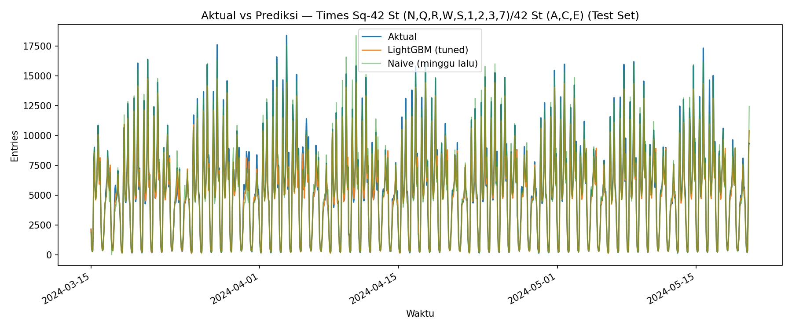
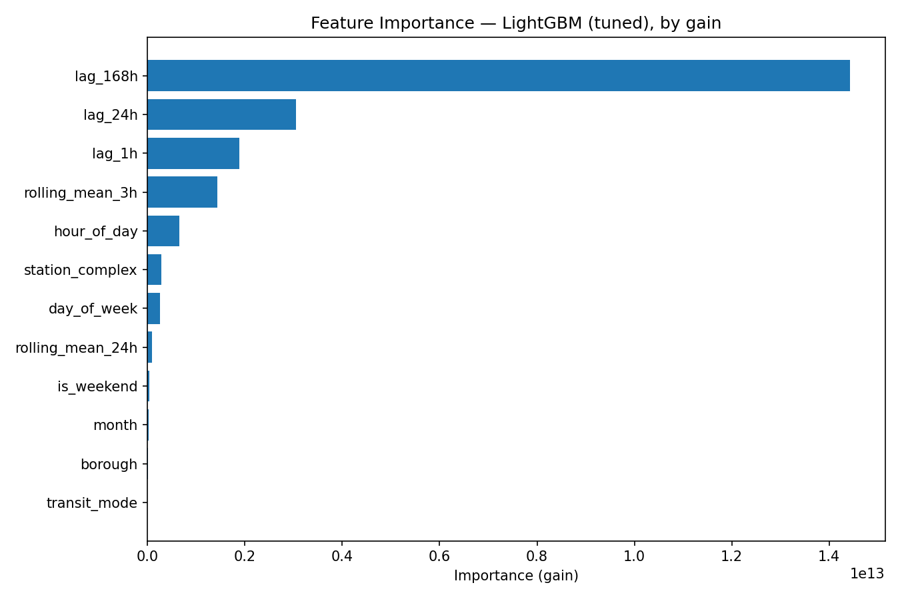

# Hourly Passenger Demand Forecasting for Mass Transit Stations

## Latar Belakang

Proyek ini membangun pipeline data science end-to-end untuk memprediksi jumlah penumpang (entries) per stasiun per jam pada jaringan transit massal, menggunakan data riil MTA (New York) sebagai studi kasus. Cakupan pekerjaan meliputi data profiling, cleaning skala besar (~7,5 GB), EDA, feature engineering, modeling time-series dengan LightGBM, hyperparameter tuning (Optuna) dengan experiment tracking (MLflow), evaluasi terhadap baseline, hingga dashboard interaktif untuk eksplorasi mandiri.

## Masalah

Operator transportasi massal butuh mengetahui **kapan** dan **di stasiun mana** kepadatan penumpang akan tinggi, supaya alokasi armada, jadwal, dan petugas lapangan bisa diatur secara proaktif — bukan reaktif setelah penumpukan terjadi. Tanpa model prediktif, perencanaan operasional hanya mengandalkan pola historis kasar atau intuisi.

## Tujuan

1. Membangun model forecasting jumlah penumpang per stasiun per jam yang mengungguli baseline naif.
2. Mengidentifikasi pola kepadatan: jam sibuk, perbedaan weekday vs weekend, stasiun dengan volume tertinggi/paling volatil.
3. Menyajikan hasil dalam dashboard interaktif untuk eksplorasi mandiri (filter stasiun, rentang waktu, aktual vs prediksi).

## Sumber Data

[MTA Subway Hourly Ridership 2022–2024 (Kaggle)](https://www.kaggle.com/datasets/yaminh/mta-subway-hourly-ridership-2022-to-2024) — granularitas per jam per stasiun, sumber asli data resmi MTA.

**Catatan penting:** skema kolom aktual dataset berbeda dari deskripsi awal — kolom volume penumpang bernama `ridership` (di-rename menjadi `entries` di pipeline ini), kategori tarif bernama `fare_class_category`, dan ada kolom tambahan `latitude`/`longitude`/`Georeference` yang tidak dipakai untuk forecasting per-jam. Detail lengkap ada di docstring [src/data_prep.py](src/data_prep.py).

## Metodologi

### 1. Data Profiling & Cleaning ([src/data_prep.py](src/data_prep.py))
- Rentang waktu & jumlah stasiun ditentukan dari profiling data aktual (bukan asumsi): **2022-05-15 s/d 2024-05-20**, **428 stasiun** (`station_complex_id`), meliputi 3 moda transit (subway, Staten Island Railway, tram).
- 1 baris data error dikecualikan (station id "502" berlabel `transit_mode="subway"` untuk hanya 2 jam — data mislabel, seharusnya Staten Island Railway).
- Data diagregasi dari granularitas (stasiun, jam, payment_method, fare_class_category) menjadi (stasiun, jam), lalu di-reindex ke rentang jam penuh per stasiun — gap diisi 0 (bukan interpolasi), karena semua stasiun terverifikasi membentang penuh dari awal s/d akhir periode sehingga gap paling mungkin merepresentasikan nol tap tercatat, bukan data hilang acak.
- Outlier: clip nilai negatif ke 0, dan cap lonjakan ekstrem per stasiun di atas Q3 + 3×IQR (threshold longgar supaya jam sibuk/event wajar tidak ikut terpotong).
- File 7,5 GB memerlukan pendekatan khusus: lazy `scan_csv` + `sink_parquet` untuk memangkas kolom sebelum agregasi eager (streaming `group_by` langsung gagal alokasi memori di lingkungan dengan RAM ~10,5 GB).

| Metrik | Nilai |
|---|---|
| Baris mentah (granular fare/payment) | 51.208.979 |
| Baris setelah agregasi station-hour | 7.408.718 |
| Baris setelah reindex (gap terisi) | 7.560.192 |
| Gap jam yang diisi 0 | 151.474 (~2%) |
| Baris di-cap (lonjakan ekstrem) | 70.365 (0,93%) |

### 2. EDA ([notebooks/01_eda.ipynb](notebooks/01_eda.ipynb))
Insight kunci:
- Dua jam puncak jelas: **17:00** (~665 entries/jam rata-rata) dan **16:00** (~596), plus puncak pagi **08:00** (~581) — pola commuter klasik.
- **Weekday ~1,7x lebih padat** dari weekend (340 vs 202 entries/jam rata-rata).
- **Times Sq-42 St** mendominasi (~84,5 juta entries total sepanjang 2022-2024) — jauh di atas Grand Central (#2, ~59 juta).
- **Manhattan** menyumbang ~1,26 miliar entries — jauh melampaui borough lain (Staten Island hanya ~3,9 juta).
- Beberapa stasiun (mis. "5 Av/53 St (E,M)") punya volatilitas tinggi (coefficient of variation > 1,3).

### 3. Feature Engineering ([src/features.py](src/features.py))
- Lag: `lag_1h`, `lag_24h`, `lag_168h` — dihitung per stasiun, urut waktu.
- Rolling: `rolling_mean_3h`, `rolling_mean_24h` — dihitung dari `entries.shift(1).rolling_mean(...)` supaya tidak leakage (hanya memakai jam sebelum t).
- Kalender: `hour_of_day`, `day_of_week`, `is_weekend`, `month`.
- Kategorikal: `station_complex`, `borough`, `transit_mode` (pandas `category` dtype).
- 71.904 baris (168 jam × 428 stasiun) dibuang karena lag_168h NaN di awal deret tiap stasiun.
- `transfers` sengaja tidak dipakai sebagai fitur karena tercatat di jam yang sama dengan target (leakage).

### 4. Train/Validation/Test Split ([src/split.py](src/split.py))
Split time-based, proporsional terhadap rentang aktual (bukan angka tetap), dengan pengecekan anomali wajib sebelum finalisasi:

| Split | Rentang | Baris | % |
|---|---|---|---|
| Train | 2022-05-22 s/d 2024-01-02 | 6.056.628 | 80,9% |
| Validation | 2024-01-02 s/d 2024-03-15 | 749.856 | 10,0% |
| Test | 2024-03-15 s/d 2024-05-20 | 681.804 | 9,1% |

Titik potong 80% murni jatuh tepat di tengah periode libur Natal/Tahun Baru (ridership turun drastis, mis. 25 Des ~1,3 juta vs normal ~3,5-3,9 juta/hari). Batas train/validation **digeser** ke 2024-01-02 supaya seluruh periode libur masuk training dan validation dimulai dari kondisi representatif — bukan bias oleh anomali. Batas validation/test dicek dan tidak menunjukkan anomali, sehingga tidak digeser.

### 5. Tuning & Experiment Tracking ([src/train.py](src/train.py))
- Optuna, 18 trial, mencari `num_leaves`, `max_depth`, `learning_rate`, `n_estimators` (dengan early stopping), `min_data_in_leaf`, `feature_fraction`, `bagging_fraction`.
- Setiap trial tercatat ke MLflow lokal (`./mlruns`, file-based) via `mlflow.lightgbm.autolog()`.
- Best params (val MAE 25,95): `num_leaves=215, max_depth=11, learning_rate=0.0603, n_estimators=890, min_data_in_leaf=48, feature_fraction=0.623, bagging_fraction=0.918`.

### 6. Final Training & Baseline ([src/train.py](src/train.py), [src/baseline.py](src/baseline.py))
- Model final dilatih ulang dengan best params di atas **train+val digabung**, tanpa early stopping (`n_estimators` dipakai persis dari hasil koreksi `best_iteration_`).
- Baseline pembanding: **naive forecast** (`lag_168h`, nilai jam sama minggu lalu) dan **rolling average 24 jam**.

## Hasil Akhir (Test Set)

| Model | MAE | RMSE |
|---|---|---|
| **LightGBM (tuned)** | **25,06** | **65,95** |
| LightGBM (default, sebelum tuning) | 32,51 | 83,12 |
| Baseline naive (jam sama minggu lalu) | 42,24 | 111,13 |
| Baseline rolling average 24 jam | 219,88 | 482,83 |

- LightGBM (tuned) **40,7% lebih baik** dari baseline naive, dan **22,9% lebih baik** dari LightGBM default — tuning Optuna memberi kontribusi nyata, bukan formalitas.
- **Feature importance** (by gain): `lag_168h` mendominasi total gain, diikuti `lag_24h`, `lag_1h`, `rolling_mean_3h`, `hour_of_day` — pola mingguan/harian adalah sinyal terkuat. `station_complex`/`borough`/`transit_mode` kontribusinya kecil karena histori lag sudah menangkap "identitas" perilaku tiap stasiun secara implisit.




## Dashboard

[dashboard/app.py](dashboard/app.py) — Streamlit, 1 halaman, berisi:
- **Peta seluruh 428 stasiun** (Plotly `scatter_mapbox`, gaya open-street-map tanpa token) — ukuran & warna titik merepresentasikan total volume ridership 2022-2024, stasiun yang dipilih di sidebar disorot dengan titik merah besar. Koordinat diekstrak dari kolom `latitude`/`longitude` data mentah (lihat `extract_station_locations()` di [src/data_prep.py](src/data_prep.py)) yang di-drop dari `cleaned.parquet` karena tidak dipakai untuk forecasting, lalu disimpan terpisah ke `data/processed/station_locations.parquet` khusus untuk kebutuhan peta ini.
- Filter stasiun (428 pilihan) + rentang waktu (periode test).
- Ringkasan metrik: tabel MAE/RMSE keseluruhan test set berdampingan dengan metrik ter-filter khusus stasiun/rentang yang dipilih.
- Grafik aktual vs prediksi per jam (Plotly interaktif: aktual, LightGBM tuned, naive).
- Feature importance (dihitung live dari model).
- Insight jam sibuk per stasiun (berdasarkan seluruh histori 2022-2024).

Sudah diuji langsung untuk stasiun tersibuk (Times Sq — puncak 17:00, ~10.818 entries/jam) dan stasiun sepi (Beach 105 St — puncak 07:00, ~18 entries/jam), keduanya render tanpa error dengan auto-scaling chart yang sesuai.

## Cara Menjalankan Proyek

### 1. Setup environment
```bash
pip install -r requirements.txt
```

### 2. Download dataset (jika belum ada di `data/raw/`)
```bash
python src/download_data.py
```

### 3. Jalankan pipeline berurutan
```bash
python src/data_prep.py      # cleaning -> data/processed/cleaned.parquet
python src/features.py       # feature engineering -> data/processed/features.parquet
python src/split.py          # time-based split -> train/val/test.parquet
python src/train.py          # tuning Optuna + MLflow -> models/best_params.json
python src/train.py --final  # final training (train+val) -> models/lightgbm_final.txt
python src/baseline.py       # cek cepat metrik baseline
python src/evaluate.py       # evaluasi lengkap -> models/evaluation_metrics.csv + chart
python src/predict.py        # export model ke MLflow + data/processed/predictions.parquet
```

### 4. Jalankan dashboard
```bash
streamlit run dashboard/app.py
```

### 5. (Opsional) Lihat MLflow tracking UI
```bash
mlflow ui --backend-store-uri ./mlruns
```

## Struktur Proyek

```
project-root/
├── data/
│   ├── raw/                 # dataset asli (CSV, tidak di-commit karena besar)
│   └── processed/           # cleaned/features/train/val/test/predictions.parquet
├── notebooks/
│   └── 01_eda.ipynb
├── src/
│   ├── download_data.py
│   ├── data_prep.py
│   ├── features.py
│   ├── split.py
│   ├── train.py
│   ├── baseline.py
│   ├── evaluate.py
│   └── predict.py
├── models/                  # best_params.json, lightgbm_final.txt, evaluation_metrics.csv, chart
├── dashboard/
│   └── app.py
├── requirements.txt
└── README.md
```

## Future Work

- **Temporal Fusion Transformer (TFT)** atau model deep learning time-series lain berpotensi menangkap pola non-linear/multi-horizon lebih baik, tapi di luar scope proyek ini karena kompleksitas setup & training — cukup dicatat sebagai kemungkinan pengembangan lanjutan.
- Forecasting multi-step (prediksi 24 jam ke depan sekaligus, bukan cuma 1 jam), yang relevan untuk perencanaan shift/armada harian.
- Fitur eksternal: cuaca, event kalender (konser, olahraga), gangguan layanan (service disruption) yang diketahui berkorelasi dengan lonjakan/penurunan ridership.
- Model per-cluster stasiun (bukan satu model global) untuk menangkap karakteristik stasiun yang sangat berbeda (mis. hub besar vs stasiun residensial kecil) dengan lebih presisi.
